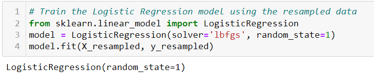

# IN PROGRESS
# Credit_Risk_Analysis

## Overview
Credit risk is an inherently unbalanced classification problem, as good loans easily outnumber risky
loans. In this project, a credit card dataset from LendingClub, a peer-to-peer lending services
company, was used to make various models by applying Machine Learning.
The following methods were applied:
1) Oversampling using the RandomOverSampler and SMOTE algorithms
2) Undersampling using the ClusterCentroids algorithm
3) Combinatorial approach of over- and undersampling using the SMOTEENN algorithm
4) Two machine learning models that reduce bias, BalancedRandomForestClassifier and
EasyEnsembleClassifier, to predict credit risk

Before any of the techniques could be used, the data had to be cleaned and sorted. The data was sorted into 2 groups - the features and target.

The features included everything except "loan_status". Here is a snapshot of the features data frame called “X”:

The target group only contain the "loan_status". Here is a snapshot of the target data called “y”:

After separating into 2 groups, the “train_test_split” method from the scikit-learn library was used to further split
the data into the 4 groups of X_train, X_test, y_train, and y_test.

Since the majority class (68,470 “low risk loans”) and the minority class (347 “high risk loans”) were such different sizes, the following methods were applied to see which had the best results.

## Oversampling Results

### RandomOverSampler
One approach to addressing imbalanced datasets is to oversample the minority class. The RandomOverSampler method from imbalanced-learn library randomly duplicates examples in the minority class of the training dataset. After using this method, there were 51,366 “low_risk” and 51,366 “high_risk”.

Then a LogisticRegression model was used to “fit” the data using the scikit-learn library.

Next, a balanced_accuracy_score was calculated.

Thereafter, a confusion matrix was created from the scikit-learn library and then an “Imbalanced
Classification Report” was calculated using the imbalanced-learn library method of classification_report_imbalaced.

### SMOTE Oversampling
This is a type of data augmentation for the minority class and is referred to as the
Another approach to addressing imbalanced datasets to oversample the minority class is that new
examples can be synthesized from the existing examples. The Synthetic Minority Oversampling
Technique, or SMOTE for short, method from imbalanced-learn library accomplishes this goal. SMOTE works by
selecting examples that are close in the feature space, drawing a line between the examples in the
feature space and drawing a new sample at a point along that line.
After using this method, similar to the RandomOver Sampling method, there were also 51,366
“low_risk” and 51,366 “high_risk”.

## Undersampling Results
Undersampling techniques remove examples from the training dataset that belong to the majority class
in order to better balance the class distribution, such as reducing the skew from a 1:100 to a 1:10, 1:2,
or even a 1:1 class distribution.
### ClusterCentroids
The ClusterCentroids algorithm from the imbalanced-learn library is a method that reduces the number
of samples while generating a new set according to the given original data set. This means that it will
remove the majority class and generating a new set

