# Credit_Risk_Analysis

## Overview
Credit risk is an inherently unbalanced classification problem, as good loans easily outnumber risky loans. In this project, a credit card dataset from LendingClub, a peer-to-peer lending services company, was used to make various models by applying Machine Learning.
The following methods were applied:
1) Oversampling using the RandomOverSampler and SMOTE algorithms
2) Undersampling using the ClusterCentroids algorithm
3) Combinatorial approach of over- and undersampling using the SMOTEENN algorithm
4) Two machine learning models that reduce bias, BalancedRandomForestClassifier and
EasyEnsembleClassifier, to predict credit risk

Before any of the techniques could be used, the data had to be cleaned and sorted. The data was sorted into 2 groups - the features and target.

The features included everything except "loan_status". Here is a snapshot of the features data frame called “X”:
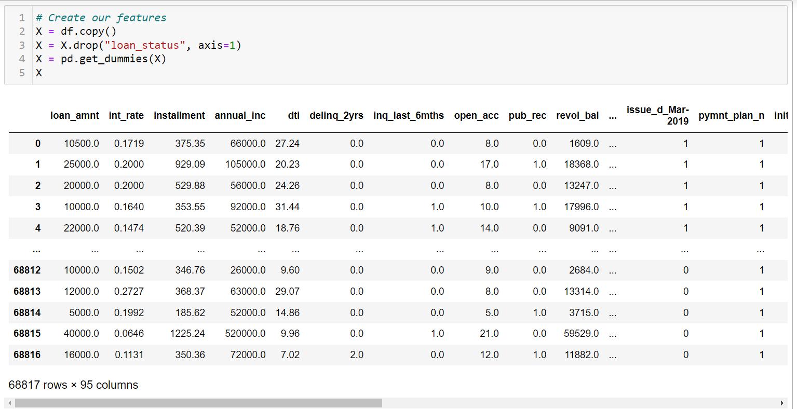

The target group only contains the "loan_status". Here is a snapshot of the target data called “y”:

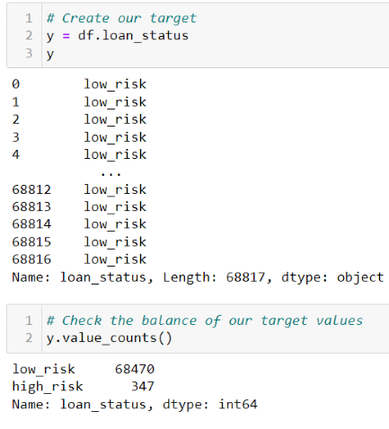

After separating into 2 groups, the “train_test_split” method from the scikit-learn library was used to further split the data into the 4 groups of X_train, X_test, y_train, and y_test.

Since the majority class (68,470 “low risk loans”) and the minority class (347 “high risk loans”) were such different sizes, the following methods were applied to see which had the best results.

## Oversampling Results

### Random Over Sampler
One approach to addressing imbalanced datasets is to oversample the minority class. The RandomOverSampler method, from the imbalanced-learn library, randomly duplicates examples in the minority class of the training dataset. After using this method, there were 51,366 “low_risk” and 51,366 “high_risk”.

Then a LogisticRegression model was used to “fit” the data using the scikit-learn library.

Next, a balanced_accuracy_score was calculated.
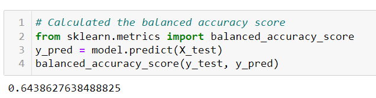
Thereafter, a confusion matrix was created from the scikit-learn library and then an “Imbalanced
Classification Report” was calculated using the imbalanced-learn library method of classification_report_imbalaced.
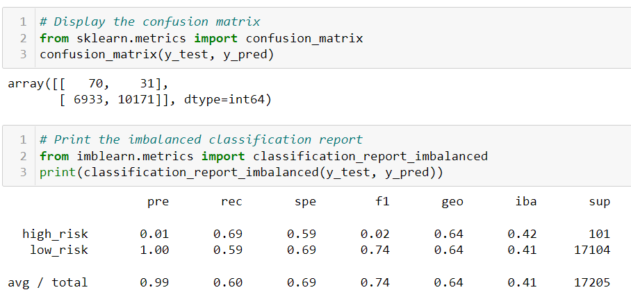

### SMOTE Oversampling
Another approach to addressing imbalanced datasets to oversample the minority class is that new examples can be synthesized from the existing examples. The Synthetic Minority Oversampling Technique, or SMOTE for short, method from imbalanced-learn library accomplishes this goal. SMOTE works by selecting examples that are close in the feature space, drawing a line between the examples in the feature space and drawing a new sample at a point along that line. 

After using this method, similar to the RandomOverSampling method, there were also 51,366
“low_risk” and 51,366 “high_risk”.
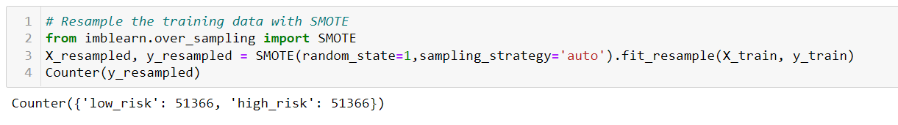

The following steps were applied just like before with theRandomOverSampling method: 

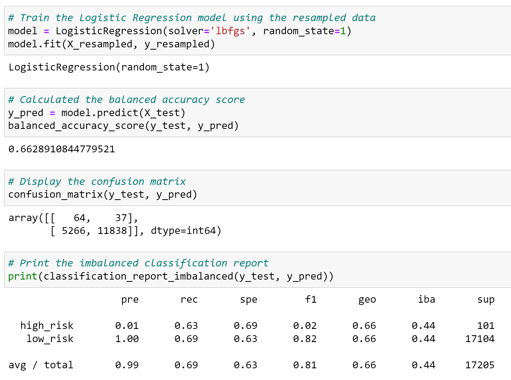

## Undersampling Results
Undersampling techniques remove examples from the training dataset that belong to the majority class in order to better balance the class distribution, such as reducing the skew from a 1:100 to a 1:10, 1:2,
or even a 1:1 class distribution.

### Cluster Centroids
Cluster centroid undersampling algorithm identifies clusters of the majority class, then generates synthetic data points, called centroids, that are representative of the clusters. The majority class is then undersampled down to the size of the minority class.

After using the ClusterCentroids method on the data, there were 246 "high_risk" and 246 "low-risk". 
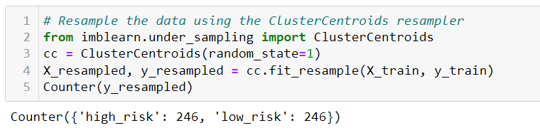

Just like before, the following steps were taken:
1) The resampled data was fitted to a logistic regression model. 
2) Balanced Accuracy was calculated
3) Confusion Matrix was displayed
4) The imbalanced classification report was displayed

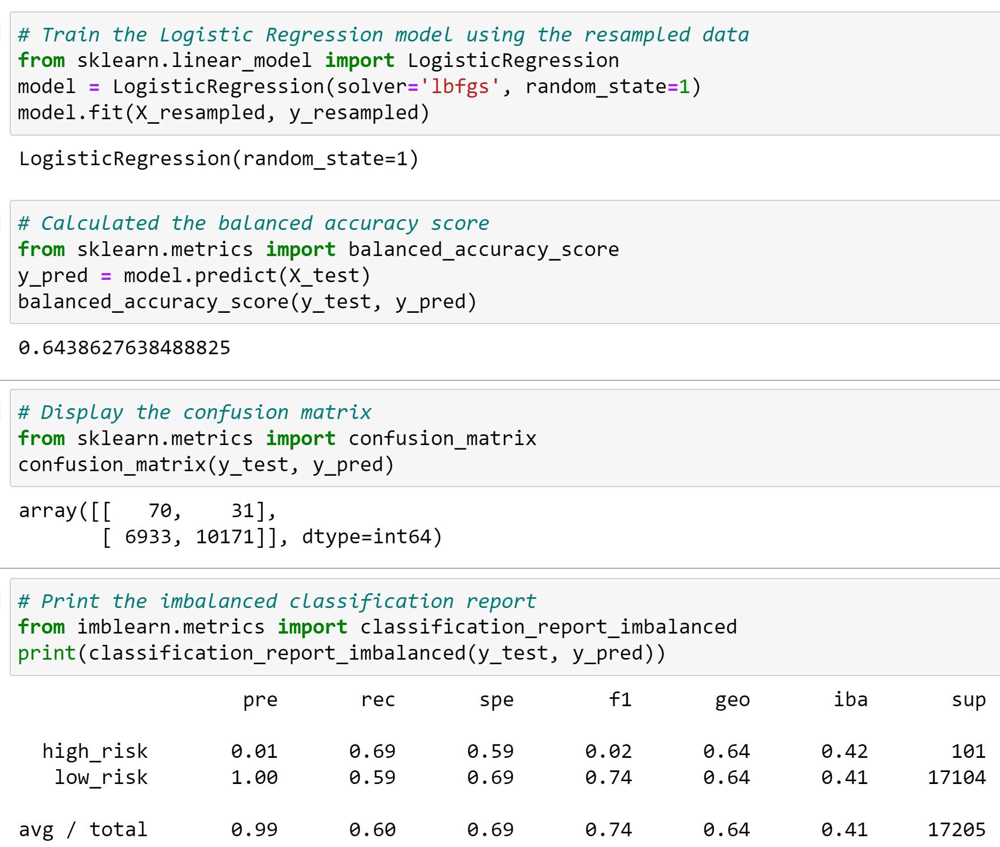

## Combination (Over and Under) Sampling Results
A downside of oversampling with SMOTE is its reliance on the immediate neighbors of a data point. Because the algorithm doesn't see the overall distribution of data, the new data points it creates can be heavily influenced by outliers. This can lead to noisy data. With undersampling, the downsides are that it involves loss of data and is not an option when the dataset is small. One way to deal with these challenges is to use a sampling strategy that is a combination of oversampling and undersampling.

### SMOTEENN
SMOTEENN combines the SMOTE and Edited Nearest Neighbors (ENN) algorithms. SMOTEENN is a two-step process:
1) Oversample the minority class with SMOTE.
2) Clean the resulting data with an undersampling strategy. If the two nearest neighbors of a data point belong to two different classes, that data point is dropped.

The SMOTEENN method was then applied to our data.  The result was having 68,460 "high_risk" and 62011 "low_risk". Then the model was created with our oversampled & undersampled data.

Yet again, the same coding/calculations were made to evaluate the model.

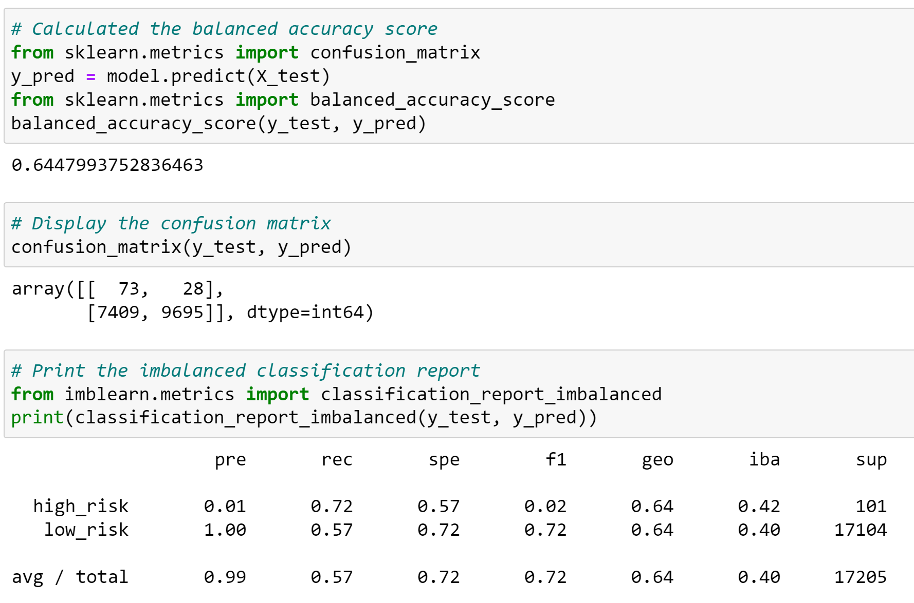

## Ensemble Classifiers Results

Ensemble learning is the process of combining multiple models to help improve the accuracy and strength, as well as decrease the variance of a model, in order to increase the overall performance of a model. 

### Balanced Random Forest Classifier
Instead of having a single, complex tree like the ones created by decision trees, a random forest algorithm will sample the data and build several smaller, simpler decision trees. Each tree is simpler because it is built from a random subset of features. The Balanced Random Forest Classifier (from the imbalanced-learn library ) is an ensemble method in which each tree of the forest will be provided a balanced bootstrap sample which still provides all functionality of the RandomForestClassifier:

To use the Balanced Random Forest Classifier, we did an import for the imbalanced-learn library and then fit the model using our training data. 
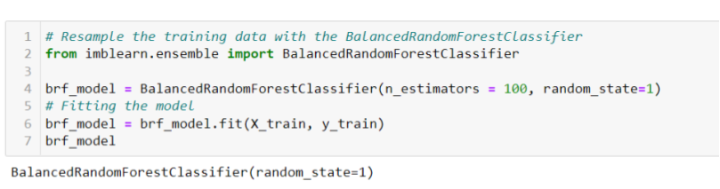

Next, we used all the same metrics as before to evaluate our model:
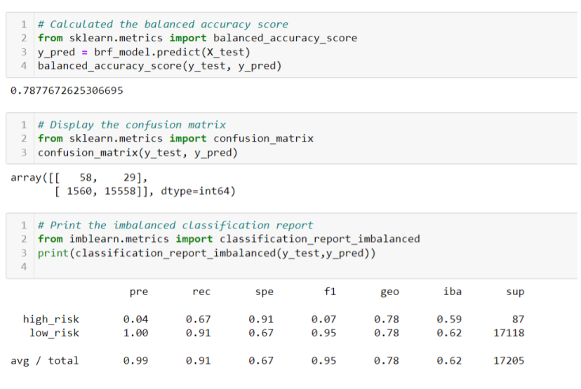

To see which features, the model found the most important, a dataframe was then created which ordered the features in descending order:
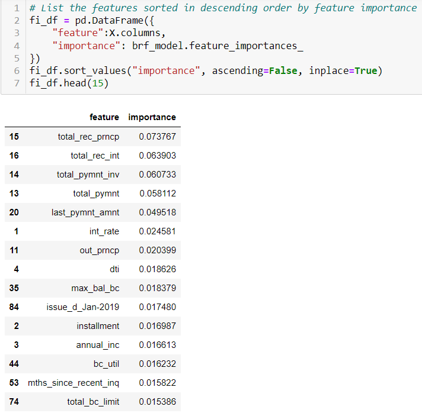

Here is a graph which shows the same data:

### Easy Ensemble AdaBoost Classifier
Last, but not least, was the AdaBoost Ensemble. The AdaBoost algorithm involves using very short (one-level) decision trees as weak learners that are added sequentially to the ensemble. Each subsequent model attempts to correct the predictions made by the model before it in the sequence. This is achieved by weighing the training dataset to put more focus on training examples on which prior models made prediction errors

Here is the code to apply AdaBoost and fit the model:
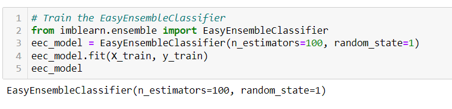

Here are the metrics to evaluate the model:

## Summary
To decide which of the models is the best to use, I made a summary table with all of the models showing the following:
* accuracy
* Precision
* Recall (Sensitivity)
* Specificity
* F1 Score
  
There are other metrics besides these, but I felt that these were the ones I should focus on.

Here is the model summary table:

*Note*  
TP = True Positive &nbsp; FP = False Positive &nbsp; 
TN = True Negative  &nbsp;  FN = False Negative

### Accuracy
The accuracy score is simply the percentage of predictions that are correct. Here is the formuala to calculate accuracy.

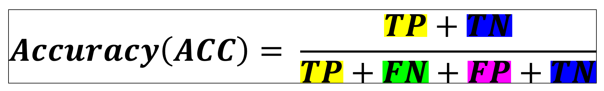

The AdaBoost Classifier had an accuracy score 0.93, which means the model was correct 93% of the time.  This was significantly  higher than all the other models.

### Precision
Precision tells us how reliable a positive classification is.  For our purposes with credit risk, it is telling us if a loan is deemed to be "loan risk" how likely is it actually a "low risk" loan. Likewise, it would tell us if a loan was deemed "high risk", how likely it was actually a "high risk" loan.

Here is the formula for precision:

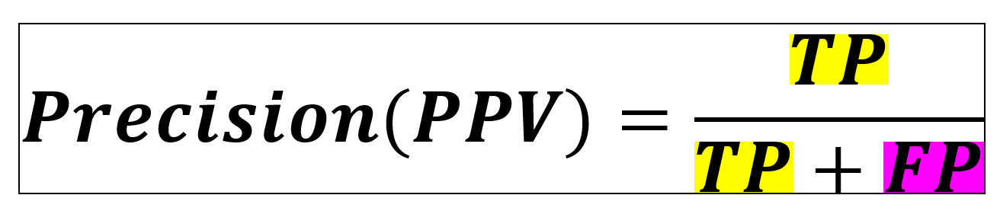

All of our models had almost 100% precision for low_risk loans. However, they all have low precision for high_risk loans.  This means that most loans are being classified as "low_risk".  This is not so good for the banks because the "high_risk" loans are not being caught enough.  

The best precision rate for "high risk" was the AdaBoost model with 0.07, meaning that it caught "high_risk" loans only 7% of the time.  

### Recall / Sensitivity
Another way to assess a model's performance is with sensitivity, also called recall. Sensitivity is the converse statement of precision.  It would say "If a loan is actually high_risk, would the model classify it high_risk?" Here is the formula for sensitivity:

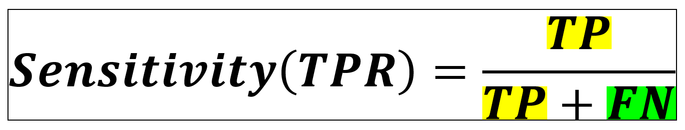

The model with the best recall/sensitivity was again AdaBoost with a recall of 0.91 for high_risk and 0.94 for low_risk.  This means that loans that were actually high_risk were classified high_risk 91% of the time and loans that were actually low_risk were classified low_risk 94% of the time. 

### F1 Score
The F1 score is a way of combining the precision and recall of the model, and it is defined as the harmonic mean of the model’s precision and recall. Here is the formula for F1:

The model with the best F1 score for both high_risk and low_risk was yet again AdaBoost.  It had a F1-score of 0.14 for high_risk and 0.97 for low_risk. 

### Recommendation
It is apparent that the AdaBoost Classifier is the best model out of all 6. It had the highest scores for all the metrics discussed.  If a model had to be chosen from this bunch, I would choose AdaBoost.

The main goal of this model is to flag "high_risk" loans and this model still has some room for improvement.  I would like to see more work done on another model to see if we can have a higher Precision & Recall to catch the "high_risk" loans.  Otherwise, the AdaBoost does seem like a good model if all other possibilities have been exhausted and tested.
